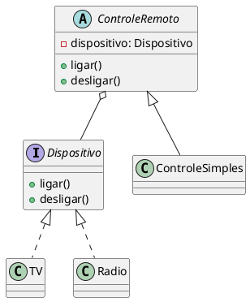
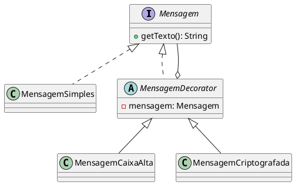
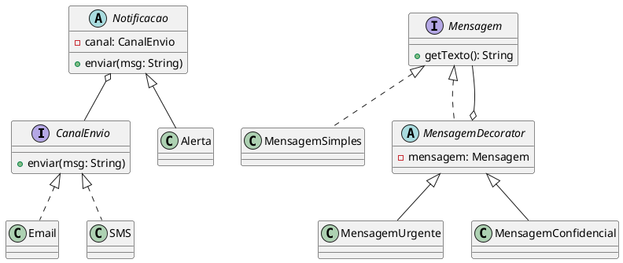

# **Padrões GoF: Bridge e Decorator**

## **🌉 Padrão Bridge**

Desacoplar uma abstração de sua implementação, permitindo que ambos variem independentemente

**Analogia**

Imagine um controle remoto (abstração) que pode operar diversas marcas de TVs (implementações). Você pode ter vários tipos de controles e várias marcas de TV, mas não quer criar uma classe para cada combinação (ex: ControleSamsungComum, ControleLGSmart…).

---

### **Estrutura em Java**

```java
// Implementador
interface Dispositivo {
    void ligar();
    void desligar();
}

// Implementações concretas
class TV implements Dispositivo {
    public void ligar() {
        System.out.println("TV ligada");
    }

    public void desligar() {
        System.out.println("TV desligada");
    }
}

class Radio implements Dispositivo {
    public void ligar() {
        System.out.println("Rádio ligado");
    }

    public void desligar() {
        System.out.println("Rádio desligado");
    }
}

// Abstração
abstract class ControleRemoto {
    protected Dispositivo dispositivo;

    public ControleRemoto(Dispositivo dispositivo) {
        this.dispositivo = dispositivo;
    }

    public abstract void ligar();
    public abstract void desligar();
}

// Refina a abstração
class ControleSimples extends ControleRemoto {
    public ControleSimples(Dispositivo dispositivo) {
        super(dispositivo);
    }

    public void ligar() {
        dispositivo.ligar();
    }

    public void desligar() {
        dispositivo.desligar();
    }
}
```

---

### **Diagrama UML – Bridge**




---

## **🎨 Padrão Decorator**

### **Intenção**

Adicionar funcionalidades a um objeto de forma dinâmica, sem modificar sua estrutura original.

### **Analogia**

Imagine que você quer enviar uma mensagem. Às vezes, essa mensagem deve ser criptografada, outras vezes, formatada em caixa alta. Em vez de criar várias subclasses como MensagemCriptografadaMaiuscula, usamos “camadas” de comportamento.

---

### **💡 Estrutura em Java**

```java
// Componente base
interface Mensagem {
    String getTexto();
}

// Componente concreto
class MensagemSimples implements Mensagem {
    public String getTexto() {
        return "Olá, mundo";
    }
}

// Decorator base
abstract class MensagemDecorator implements Mensagem {
    protected Mensagem mensagem;

    public MensagemDecorator(Mensagem mensagem) {
        this.mensagem = mensagem;
    }
}

// Decorators concretos
class MensagemCaixaAlta extends MensagemDecorator {
    public MensagemCaixaAlta(Mensagem mensagem) {
        super(mensagem);
    }

    public String getTexto() {
        return mensagem.getTexto().toUpperCase();
    }
}

class MensagemCriptografada extends MensagemDecorator {
    public MensagemCriptografada(Mensagem mensagem) {
        super(mensagem);
    }

    public String getTexto() {
        return "***" + mensagem.getTexto() + "***";
    }
}
```

---

### **Diagrama UML – Decorator**



---

## **⚔️ Comparando os padrões**

| **Característica** | **Bridge** | **Decorator** |
| --- | --- | --- |
| Objetivo | Separar abstração da implementação | Adicionar comportamento dinamicamente |
| Arquitetura | Duas hierarquias (Abstração e Impl.) | Camadas de objetos |
| Uso típico | GUI, Drivers | Streams, Formatação, Loggers |
| Exemplo real | Controle + TV | BufferedReader, InputStreamReader |

---

## **EXERCÍCIO PRÁTICO**

Crie um sistema de notificações onde:

1. A forma de envio (Email ou SMS) é desacoplada da lógica de negócio (Bridge).
2. As mensagens podem ser modificadas dinamicamente com prefixos como [URGENTE], [CONFIDENCIAL] (Decorator).

---

### **Exemplo de uso:**

```
Notificacao alerta = new Alerta(new Email());
Mensagem mensagem = new MensagemUrgente(new MensagemSimples("Sistema fora do ar"));
alerta.enviar(mensagem.getTexto());
```

**Saída esperada**:

```
Enviando por EMAIL: [URGENTE] Sistema fora do ar
```

---

### **Código-base (Gabarito)**

### **1. Parte Bridge**

```java
interface CanalEnvio {
    void enviar(String mensagem);
}

class Email implements CanalEnvio {
    public void enviar(String mensagem) {
        System.out.println("Enviando por EMAIL: " + mensagem);
    }
}

class SMS implements CanalEnvio {
    public void enviar(String mensagem) {
        System.out.println("Enviando por SMS: " + mensagem);
    }
}

abstract class Notificacao {
    protected CanalEnvio canal;

    public Notificacao(CanalEnvio canal) {
        this.canal = canal;
    }

    public abstract void enviar(String mensagem);
}

class Alerta extends Notificacao {
    public Alerta(CanalEnvio canal) {
        super(canal);
    }

    public void enviar(String mensagem) {
        canal.enviar(mensagem);
    }
}
```

---

### **2. Parte Decorator**

```java
interface Mensagem {
    String getTexto();
}

class MensagemSimples implements Mensagem {
    private String texto;

    public MensagemSimples(String texto) {
        this.texto = texto;
    }

    public String getTexto() {
        return texto;
    }
}

abstract class MensagemDecorator implements Mensagem {
    protected Mensagem mensagem;

    public MensagemDecorator(Mensagem mensagem) {
        this.mensagem = mensagem;
    }
}

class MensagemUrgente extends MensagemDecorator {
    public MensagemUrgente(Mensagem mensagem) {
        super(mensagem);
    }

    public String getTexto() {
        return "[URGENTE] " + mensagem.getTexto();
    }
}

class MensagemConfidencial extends MensagemDecorator {
    public MensagemConfidencial(Mensagem mensagem) {
        super(mensagem);
    }

    public String getTexto() {
        return "[CONFIDENCIAL] " + mensagem.getTexto();
    }
}
```

---

Teste:

```java
public class Main {
    public static void main(String[] args) {
        // Mensagem simples
        Mensagem simples = new MensagemSimples("Servidor com lentidão");

        // Decorada com URGENTE
        Mensagem urgente = new MensagemUrgente(simples);

        // Decorada com CONFIDENCIAL + URGENTE
        Mensagem urgenteConfidencial = new MensagemConfidencial(urgente);

        // Canal de envio por Email
        Notificacao alertaEmail = new Alerta(new Email());
        alertaEmail.enviar(urgenteConfidencial.getTexto());

        // Canal de envio por SMS
        Notificacao alertaSMS = new Alerta(new SMS());
        alertaSMS.enviar(new MensagemUrgente(
                            new MensagemSimples("Senha do banco foi alterada")
                        ).getTexto());

        // Mensagem simples via Email
        alertaEmail.enviar(new MensagemSimples("Atualização concluída com sucesso").getTexto());
    }
}
```

### **Diagrama UML do Exercício**



---

Vide pasta projeto para o códig-fonte do exercício